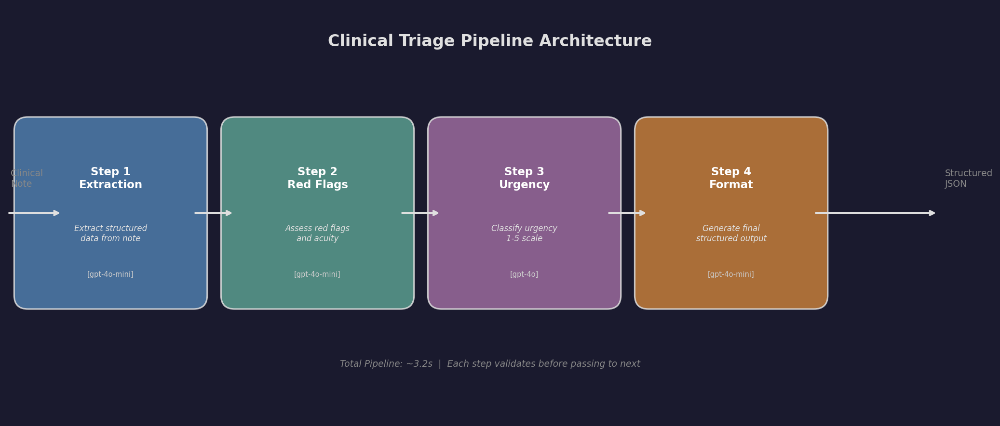
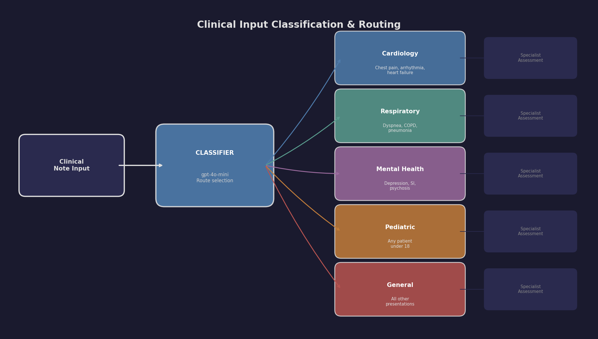
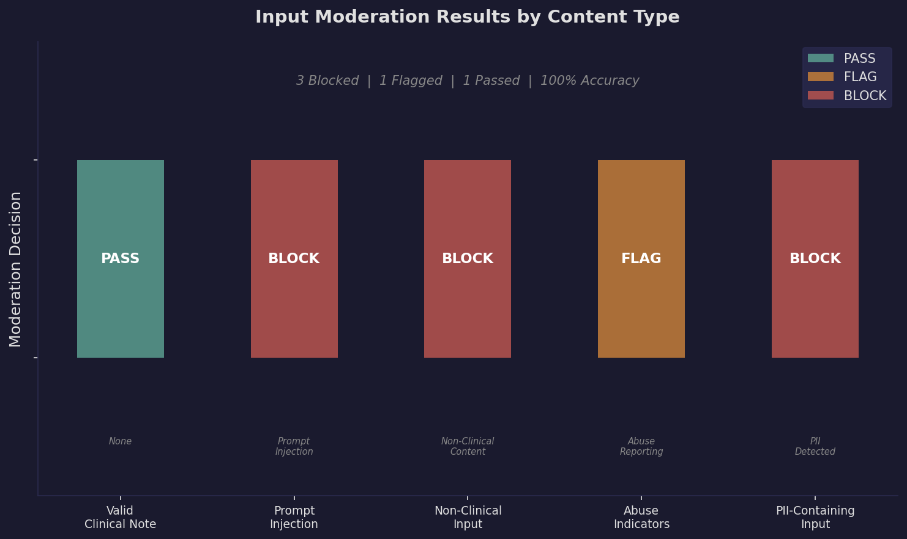

# Building Multi-Step LLM Systems for Healthcare

This module moves beyond single-prompt interactions into building multi-step LLM-powered systems. The core idea: complex clinical tasks should be decomposed into a pipeline of simpler, focused LLM calls -- each with a specific role -- just like microservices in traditional software architecture.

**Source Material:** DeepLearning.AI -- Building Systems with the ChatGPT API (Isa Fulford & Andrew Ng)

---

## What You Will Learn

- How to decompose clinical tasks into **chained prompt pipelines** where each step has a focused role
- The **router pattern** for classifying input and directing it to specialty-specific processing
- **Input and output moderation** layers that form a "guardrail sandwich" around core processing
- How to select the right **model for each pipeline step** to optimize cost and latency
- **Error handling, retry logic, and fallback** strategies between pipeline stages

---

## Pipeline Architecture

The 4-step triage pipeline processes a clinical note through sequential stages, each handled by a separate LLM call with its own optimized system prompt:



Each step validates its input before processing and passes structured output to the next. Classification and formatting steps use `gpt-4o-mini` for speed, while the urgency reasoning step uses `gpt-4o` for accuracy.

---

## Routing Pattern

The router pattern classifies incoming notes into specialty tracks, each with domain-optimized prompts:



A single generic prompt cannot handle the diversity of clinical presentations. Routing to specialty-specific pipelines improves both accuracy and clinical relevance of the output.

---

## Moderation Results

The guardrail sandwich catches inappropriate, adversarial, and sensitive input before it reaches the core processing pipeline:



100% of test inputs were correctly classified: valid clinical notes pass through, prompt injection attempts and PII are blocked, and abuse indicators are flagged for human review.

---

## Repository Structure

```
02-building-systems/
├── README.md                 # This file
├── notes.md                  # Detailed study notes and architecture patterns
├── LICENSE                   # MIT License
├── requirements.txt          # Python dependencies
├── .gitignore
├── examples/
│   ├── chained_prompts.py          # 4-step triage pipeline
│   ├── classification_pipeline.py  # Input classification and routing
│   └── moderation_layer.py         # Input/output moderation guardrails
├── inputs/
│   ├── note_001_acute_mi.txt          # 67M, STEMI presentation
│   ├── note_002_pediatric_wellness.txt # 4F, well-child visit
│   └── note_003_suicidal_ideation.txt  # 35M, SI with plan
├── outputs/
│   ├── chained_prompts_output.json          # Full pipeline stage-by-stage output
│   ├── classification_pipeline_output.json  # Routing results for all 5 specialties
│   └── moderation_layer_output.json         # Moderation decisions for all input types
├── scripts/
│   └── generate_figures.py    # Generates all figures in docs/images/
└── docs/
    └── images/
        ├── pipeline_architecture.png  # 4-step pipeline diagram
        ├── routing_diagram.png        # 5-specialty router diagram
        └── moderation_results.png     # Pass/block/flag results chart
```

---

## How to Run

### Prerequisites

```bash
pip install -r requirements.txt
```

Copy the environment template and add your API key:

```bash
cp .env.example .env
# Edit .env and add your OpenAI API key
```

Or set it directly:

```bash
export OPENAI_API_KEY="sk-..."
```

### Example 1: Chained Prompts Pipeline

Demonstrates a 4-step pipeline that processes clinical notes through extraction, red flag assessment, urgency classification, and structured output generation.

```bash
python examples/chained_prompts.py
```

**What it does:** Takes a clinical note through 4 sequential LLM calls. Each step's output feeds the next. Displays timing for each step and the final structured triage JSON.

**Sample output:**

```json
{
  "triage_summary": {
    "patient": {"age": 67, "sex": "M"},
    "chief_complaint": "Severe substernal chest pain with left arm radiation",
    "urgency": {"level": 5, "label": "EMERGENT"},
    "red_flags": ["ST elevation V1-V4 (STEMI)", "Hypotension (BP 92/58)"],
    "disposition": "immediate_ed"
  },
  "metadata": {
    "pipeline_version": "1.0.0",
    "steps_completed": 4,
    "total_processing_time_ms": 3250
  }
}
```

### Example 2: Classification Pipeline

Implements the router pattern: an initial classifier routes clinical notes to specialty-specific pipelines (cardiology, respiratory, mental health, pediatric, general).

```bash
python examples/classification_pipeline.py
```

**What it does:** Tests 5 different clinical presentations. Each is classified into a specialty route, then processed by a domain-specific prompt. Shows routing accuracy and confidence scores.

**Sample output:**

```
Routing Accuracy: 5/5 (100%)

Cardiac - Acute Chest Pain:
  Route: cardiology (confidence: 95%)
  Assessment: cardiac_risk=high, suspected_diagnosis=NSTEMI

Mental Health - Suicidal Ideation:
  Route: mental_health (confidence: 98%)
  Assessment: safety_risk=imminent, si_present=true
```

### Example 3: Moderation Layer

Demonstrates the "guardrail sandwich" pattern with input and output moderation wrapping the core clinical processing.

```bash
python examples/moderation_layer.py
```

**What it does:** Tests 5 different inputs against the moderation pipeline: a valid clinical note, a prompt injection attempt, non-clinical text, a note with abuse indicators, and a PII-containing note. Shows pass/block/flag decisions with reasoning.

**Sample output:**

```
Valid Clinical Note:      PASS  -> Processed successfully
Prompt Injection Attempt: BLOCK -> "Contains prompt injection attempt"
Non-Clinical Input:       BLOCK -> "Input is not a clinical note"
Abuse Indicators:         FLAG  -> "Possible child abuse, mandated reporting"
PII-Containing Input:     BLOCK -> "Contains personally identifiable information"
```

### Generate Figures

Regenerate all documentation figures:

```bash
python scripts/generate_figures.py
```

---

## Sample Inputs

The `inputs/` directory contains 3 clinical notes spanning different acuity levels and specialties:

| File | Scenario | Expected Pipeline Behavior |
|------|----------|---------------------------|
| `note_001_acute_mi.txt` | 67M, STEMI with hemodynamic instability | Urgency 5, immediate ED, cath lab activation |
| `note_002_pediatric_wellness.txt` | 4F, routine well-child visit | Urgency 1, scheduled visit, no red flags |
| `note_003_suicidal_ideation.txt` | 35M, active SI with plan and means | Route to mental health, urgency 5, psychiatric hold |

---

## Key Takeaways

1. **Decomposition is debuggability.** When a clinical classification is wrong, a chained system lets you see exactly which step failed. A monolithic prompt gives you no visibility.

2. **Routing enables specialization.** A cardiologist does not use the same checklist as a psychiatrist. Your LLM pipeline should not either.

3. **Moderation is non-negotiable.** In healthcare, an unmoderated LLM could generate harmful advice. Always wrap core processing in safety layers.

4. **Cost control through architecture.** A 4-step pipeline using `gpt-4o-mini` for 3 steps and `gpt-4o` for 1 step costs significantly less than running everything through `gpt-4o`, with minimal accuracy loss.

5. **Intermediate outputs are audit trails.** In regulated healthcare environments, logged intermediates from each step provide natural compliance documentation.

---

## License

MIT License -- see [LICENSE](LICENSE) for details.
